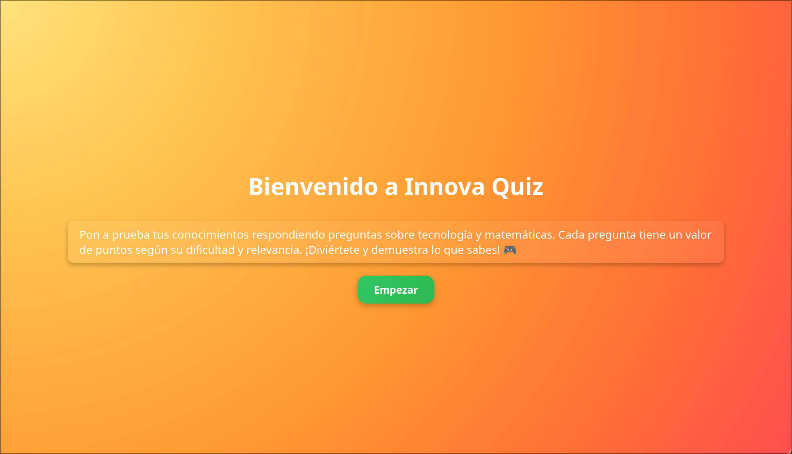
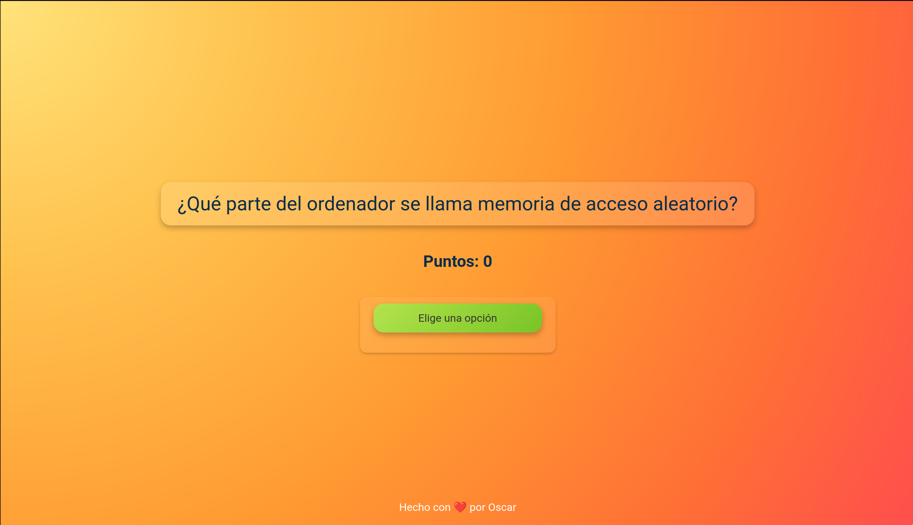
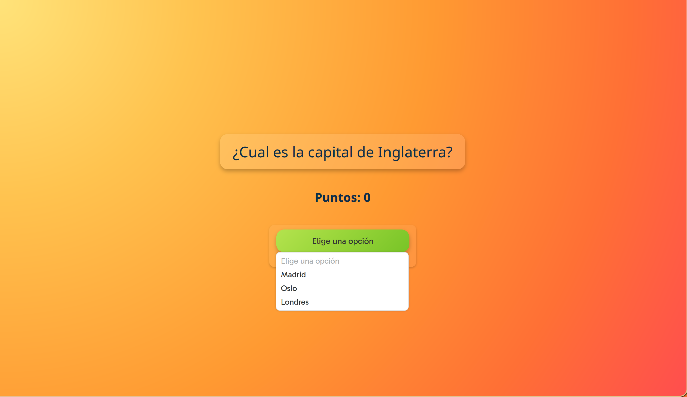
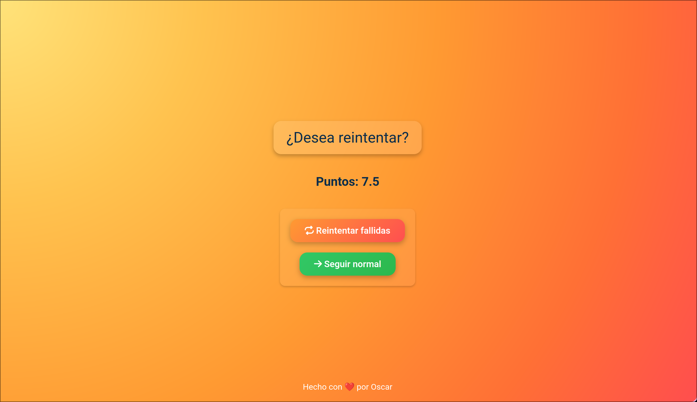
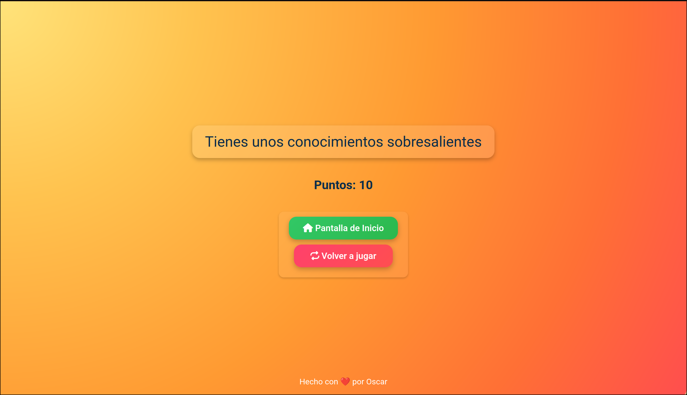

# 🎮 Innova Quiz

**Innova Quiz** es un pequeño juego de preguntas tipo trivia, desarrollado como proyecto para la asignatura de **LMSXI**. Las preguntas están centradas principalmente en temas de 🧮 matemáticas e 🖥️ informática, y tienen un nivel de dificultad accesible.

## ❓ ¿De qué trata?

Este juego consiste en responder preguntas con varias opciones ✅❌, mostrando al usuario si ha acertado o no mediante imágenes y animaciones.  
Actualmente es una aplicación **mono-usuario** 👤 y las preguntas están definidas directamente en el código fuente 🧾.

## 🛠️ Tecnologías y herramientas usadas

- 🧱 **HTML5** y 🎨 **CSS3** para la estructura y el diseño visual del juego.
- 🧠 **JavaScript** para la lógica del juego.
- 💫 [**AnimeJS**](https://animejs.com/) para animaciones fluidas y visuales atractivas, lo aproveche en la animación de la imagen del Feedback algunas otras me las puso ChatGPT en CSS.

## 📚 Aprendizajes y apoyo

Durante el desarrollo del proyecto:

- Utilicé 🤖 **ChatGPT** para resolver asuntos puntuales en el JavaScript.
- Por ejemplo, me ayudó a solucionar un problema con el cambio de imagen que indica si la respuesta es correcta o incorrecta 🟢🔴. Aunque al final adapté la solución por mi cuenta tras entenderla mejor 🧠.
- También me apoyé en la 📖 documentación oficial de AnimeJS y CSS(principalmente animaciones de botones y cosas así más esteticas y pequeñas la animacion más compleja que es la de la imagen de Feedback si usa AnimeJS) para aprender a crear y personalizar animaciones.
- Ahora entiendo mejor cómo manipular los objetos del DOM desde JavaScript y aplicarles efectos visuales 🎯.
- No entiendo nada de CSS ahí me apoye completamente en 🤖 **ChatGPT**.

## 🚀 Posibles mejoras

Aunque el proyecto funciona 🎉, tengo en mente varias ideas para mejorarlo:

- 📂 Leer las preguntas desde un archivo externo (por ejemplo, XML o TXT) en vez de tenerlas fijas en el código.
- 👥 Añadir soporte para múltiples usuarios.
- 🏆 Incorporar una pequeña base de datos o sistema de puntuaciones.

## 🖼️ Vista previa
Aquí incluyo capturas del juego para que veáis como es

## 🙌 Agradecimientos

- A los desarrolladores de ✨ **AnimeJS** por esta increíble herramienta.
- A 🤖 **ChatGPT** por ayudarme cuando me atasqué en algunas partes del código.

--------------------
Hecho con ❤️ por Oscar

