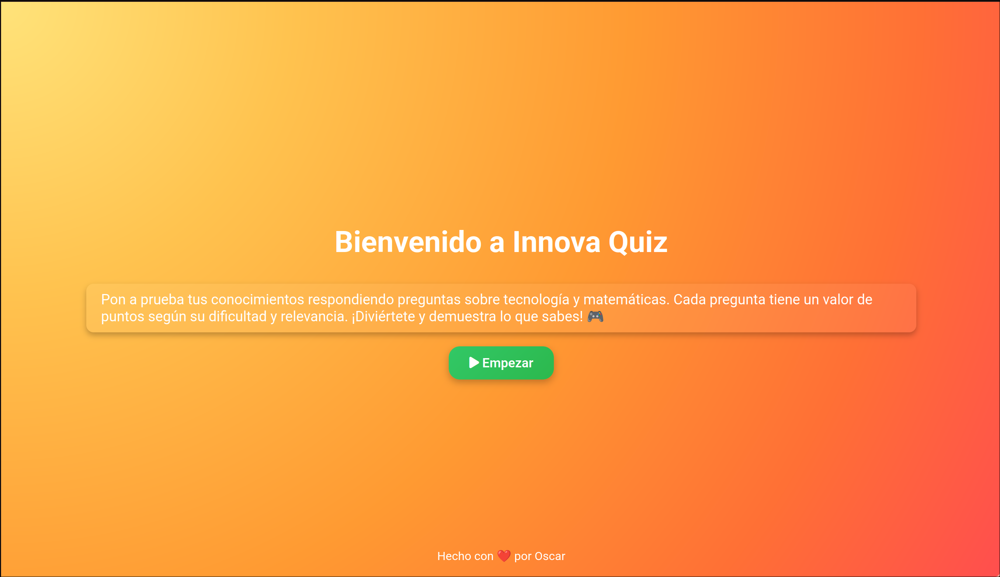

# Innova Quiz

Este es mi proyecto de juego para la asignatura de LMSXI es un pequeño trivia en el cual hay preguntas principalmente de matematicas y de informatica que no son demasiado complicadas

Este proyecto fue hecho con la ayuda de ChatGPT para el CSS y para alguna cosa en el javascript que me dio problemas y no sabia manejar, al final me dio una solucion que tras pues revisar y hacer cosas por mi cuenta la cambie que es la parte de la imagen para decir que esta bien o mal, he conseguido hacer algo funcional aunque podria haber salido mejor si supiera como hacer o lo entendiera podria hacer que el usuario tenga que meter un XML o un txt o algo así con las preguntas, pero de momento estan en el codigo y por supuesto es mono-usuario

Gracias a la libreria [AnimeJS](https://animejs.com/) que utilice para las animaciones, aqui aproveche un poco de ChatGPT y de la documentacion oficial lo entiendo mejor o eso creo que las animaciones por CSS y puedo aprovechar los objetos del HTML obtenidos en JavaScript, muchas gracias a los desarrolladores de esta herramienta

## 💻 Imagenes

--------------------
Hecho con ❤️ por Oscar

